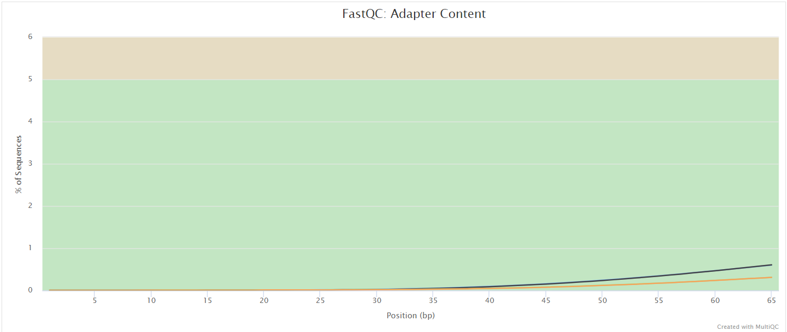

# nf-core/walkercreek: Output

## Introduction

**nf-core/walkercreek** is a bioinformatics best-practice analysis pipeline designed for the assembly, classification, and clade assignment of Illumina paired-end influenza data. As of now, this pipeline accepts the influenza modules provided by [IRMA](https://wonder.cdc.gov/amd/flu/irma/) with "FLU" set as the default module. Future versions plan to support the analysis of other viral pathogens found in [IRMA's](https://wonder.cdc.gov/amd/flu/irma/) modules, including RSV upon its release.

This document describes the output produced by the pipeline.

The directories listed below will be created in the results directory after the pipeline has finished. All paths are relative to the top-level results directory.

```bash
results/
├── abricate_flu
├── bbduk
├── consensus
├── faqcs
├── fastq
├── hemagglutinin
├── irma
├── irma_abricate_report
├── irma_consensus_qc
├── kraken2
├── lane
├── multiqc
├── ncbi_human_read_scrubber
├── neuraminidase
├── nextclade_dataset_get
├── nextclade_parser
├── nextclade_run
├── nextclade_variables
├── pipeline_info
├── qc_report
├── reports
└── SUMMARY_REPORT
```

## Pipeline overview

The pipeline is built using [Nextflow](https://www.nextflow.io/) and processes data using the following steps:

- [nf-core/walkercreek: Output](#UPHL-BioNGS-walkercreek-output)
	- [Introduction](#introduction)
	- [Pipeline Overview](#pipeline-overview)
- [SRA Sequence File Addition](#sra-sequence-file-addition)
- [Sample QC and Preprocessing](#sample-qc-preprocessing)
- [Assembly, Viral Classification, and Nextclade Variable Gathering](#assembly-viral-classification-and-nextclade-variable-gathering)
- [Influenza Clade Determination and Analysis](#influenza-clade-determination-and-analysis)
- [Summary Files](#summary-files)
	- [FastQC](#fastqc)
	- [QC report](#qc-report)
	- [MultiQC](#multiqc)
  - [SUMMARY REPORT](#summary-report)
- [Pipeline Information](#pipeline-information)

## SRA Sequence File Addition

### Extract FASTQ files from optional input file of SRA accessions

</details>

> **Downloading of FASTQ files from input file of SRA accessions using modules .**
* Prefetch sequencing reads in SRA format (`SRATools_PreFetch`)
* Convert the SRA format into one or more compressed FASTQ files (`SRATools_FasterQDump`)

## Sample QC and Preprocessing

### Prepares influenza samples (paired-end FASTQ files) for assembly. These steps also provide different quality reports for sample evaluation.

* Combine FASTQ file lanes, if they were provided with multiple lanes, into unified FASTQ files to ensure they are organized and named consistently (`Lane_Merge`).
* Remove human read data with the ([`NCBI_SRA_Human_Scrubber`](https://github.com/ncbi/sra-human-scrubber) for uploading reads to to public repositories for DNA sequencing data.
* Filter unpaired reads from FASTQ files (`SeqKit_Pair`).
* Trim reads and assess quality (`FaQCs`).
* Remove adapter sequences and phix reference with (`BBMap_BBDuk`).
* Generate a QC report by extracting data from the FaQCs report data (`QC_Report`).
* Assess read data with (`Kraken2_Kraken2`) to identify the species represented.
* [`FastQC`](https://www.bioinformatics.babraham.ac.uk/projects/fastqc/) - Filtered reads QC
* [`MultiQC`](http://multiqc.info/) - Aggregate report describing results and QC from the whole pipeline

**Important output files from this section:**

| File          | Path                                                              |
| ---           | ---                                                               |
| Trimmed Reads |  `(faqcs/<sampleID>*.fastq.gz)`                                   |
| Masked Reads  |  `(ncbi_sra_human_read_scrubber/<sampleID>/*_dehosted.fastq.gz)`  |
| QC Report     |  `(qc_report/qc_report.tsv)`                                      |
| MultiQC       |  `(multiqc/*)`                                                    |

## Assembly, Viral Classification, and Nextclade Variable Gathering

### Clean read data undergo assembly and influenza typing and subtyping. Based on the subtype information, Nextclade variables are gathered.

* Assembly of influenza gene segments with (`IRMA`) using the built-in FLU module. Also, influenza typing and H/N subtype classifications are made.
* QC of consensus assembly (`IRMA_Consensus_QC`).
* Generate IRMA consensus QC report (`IRMA_Consensus_QC_Reportsheet`)
* Influenza A type and H/N subtype classification as well as influenza B type and lineage classification using (`Abricate_Flu`). The database used in this task is [InsaFlu](https://genomemedicine.biomedcentral.com/articles/10.1186/s13073-018-0555-0).
* Generate a summary report for influenza classification results (`IMRA_Abricate_Reportsheet`).
* Gather corresponding Nextclade dataset using the Abricate_Flu classifcation results (`Nextclade_Variables`).

**Important output files from this section:**

| File                                      | Path                                                        |
| ---                                       | ---                                                         |
|  IRMA Consensus fasta                     |  `(irma/<sampleID>/*.irma.consensus.fasta)`                 |
|  IRMA flu type                            |  `(irma/<sampleID>/*.irma_type.txt)`                        |
|  IRMA flu subtype                         |  `(irma/<sampleID>/*.irma_subtype.txt)`                     |
|  IRMA Consensus QC                        |  `(irma_consensus_qc/irma_consensus_qc_report.tsv)`         |
|  Abricate flu type                        |  `(abricate_flu/<sampleID>/*.abricate_flu_type.txt)`        |
|  Abricate flu subtype                     |  `(abricate_flu/<sampleID>/*.abricate_flu_subtype.txt)`     |
|  Typing Report                            |  `(reports/typing_report.tsv)`                              |
|  Nextclade Variables dataset              |  `(nextclade_variables/<sampleID>/*)`                       |

## Influenza Clade Determination and Analysis

### Obtains datasets for Nextclade influenza genome analysis from the dataset determined by flu classification. Performs clade assignment, mutation calling, and sequence quality checks, followed by parsing the output report from Nextclade.

* Acquire the dataset necessary for influenza genome clade assignment with (`Nextclade_DatasetGet`).
* Determine influenza genome clade assignment, perform mutation calling, and run sequence quality checks with (`Nextclade_Run`). Additionally, for each sample processed through (`Nextclade_Run`), a phylogenomic dataset is generated named nextclade.auspice.json. This can be visualized using the [auspice.us](https://auspice.us/) platform.
* Parse the Nextclade output (`Nextclade_Parser`) and generate a report (`Nextclade_Report`).

**Important output files from this section:**

| File                                      | Path                                         |
| ---                                       | ---                                          |
|  Auspice json                             |  `(nextclade_run/<sampleID>/*.auspice.json)` |
|  Nextclade Report                         |  `(reports/nextclade_report.tsv)`            |

### QC Report
The QC report values are generated from FAQCS text file outputs.

| QC Metric                                  | Source   |
|--------------------------------------------|----------|
| Reads Before Trimming                      | FAQCS    |
| GC Before Trimming                         | FAQCS    |
| Average Q Score Before Trimming            | FAQCS    |
| Reference Length Coverage Before Trimming  | FAQCS    |
| Reads After Trimming                       | FAQCS    |
| Paired Reads After Trimming                | FAQCS    |
| Unpaired Reads After Trimming              | FAQCS    |
| GC After Trimming                          | FAQCS    |
| Average Q Score After Trimming             | FAQCS    |

### FastQC

<details markdown="1">
<summary>Output files</summary>

- `fastqc/`
  - `*_fastqc.html`: FastQC report containing quality metrics.
  - `*_fastqc.zip`: Zip archive containing the FastQC report, tab-delimited data file and plot images.

</details>

[FastQC](http://www.bioinformatics.babraham.ac.uk/projects/fastqc/) gives general quality metrics about your sequenced reads. It provides information about the quality score distribution across your reads, per base sequence content (%A/T/G/C), adapter contamination and overrepresented sequences. For further reading and documentation see the [FastQC help pages](http://www.bioinformatics.babraham.ac.uk/projects/fastqc/Help/).




> **NB:** The FastQC plots displayed in the MultiQC report shows _untrimmed_ reads. They may contain adapter sequence and potentially regions with low quality.

### MultiQC

<details markdown="1">
<summary>Output files</summary>

- `multiqc/`
  - `multiqc_report.html`: a standalone HTML file that can be viewed in your web browser.
  - `multiqc_data/`: directory containing parsed statistics from the different tools used in the pipeline.
  - `multiqc_plots/`: directory containing static images from the report in various formats.

[MultiQC](http://multiqc.info) is a visualization tool that generates a single HTML report summarising all samples in your project. Most of the pipeline QC results are visualised in the report and further statistics are available in the report data directory.

Results generated by MultiQC collate pipeline QC from supported tools e.g. FastQC. The pipeline has special steps which also allow the software versions to be reported in the MultiQC output for future traceability. For more information about how to use MultiQC reports, see <http://multiqc.info>.

### SUMMARY REPORT
#### A comprehensive report for the workflow detailed merged tsv outputs from various modules.

**Important output files from this section:**

| File                                      | Path                                         |
| ---                                       | ---                                          |
| Summary Report                            |  `(SUMMARY_REPORT/summary_report.tsv)`       |

### Pipeline information

<details markdown="1">
<summary>Output files</summary>

- `pipeline_info/`
  - Reports generated by Nextflow: `execution_report.html`, `execution_timeline.html`, `execution_trace.txt` and `pipeline_dag.dot`/`pipeline_dag.svg`.
  - Reports generated by the pipeline: `pipeline_report.html`, `pipeline_report.txt` and `software_versions.yml`. The `pipeline_report*` files will only be present if the `--email` / `--email_on_fail` parameter's are used when running the pipeline.
  - Reformatted samplesheet files used as input to the pipeline: `samplesheet.valid.csv`.

</details>

[Nextflow](https://www.nextflow.io/docs/latest/tracing.html) provides excellent functionality for generating various reports relevant to the running and execution of the pipeline. This will allow you to troubleshoot errors with the running of the pipeline, and also provide you with other information such as launch commands, run times and resource usage.
